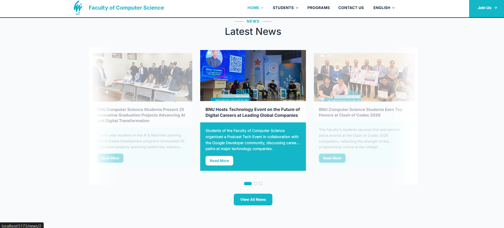
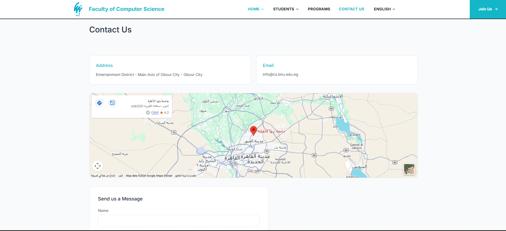

## Installation

Requires [Node.js](https://nodejs.org/) 18+ and npm.

```bash
# 1. Clone the repository
git clone <your-repo-url>
cd bnu-cs-website

# 2. Install dependencies
npm install
```

## Running Locally

```bash
npm run dev
```

Then open **http://localhost:5173** in your browser. The app supports hot-reload — changes to any file are reflected instantly.

## Build

To create an optimized production build:

```bash
npm run build
```

The compiled output is written to `dist/`. To preview the production build locally:

```bash
npm run preview
```

## Screenshots

> Add screenshots of the running app here before submitting, e.g.:
>
> | Home | Programs | News | Contact |
> |------|----------|------|---------|
> |  |  |  |  |
>
> Include both English (LTR) and Arabic (RTL) views, plus a mobile screenshot, to show the responsive and bilingual behavior.

## Notes on Data & Content

- Program, news, and staff data (names, dates, images) are sourced from the live site's public pages; descriptive text is rewritten in our own words rather than copied verbatim, in line with copyright practice.
- Images are referenced directly from `cs.bnu.edu.eg`'s public media URLs rather than re-hosted, since this is an academic/portfolio recreation and not a redistribution of the university's media assets.
- UI chrome (navigation, buttons, forms, footer) is fully bilingual via `locales/en` and `locales/ar`; RTL layout is applied automatically when Arabic is selected.

## License

This project was built for academic purposes as part of a Faculty of Computer Science coursework assignment. It is not affiliated with or endorsed by Benha National University.
