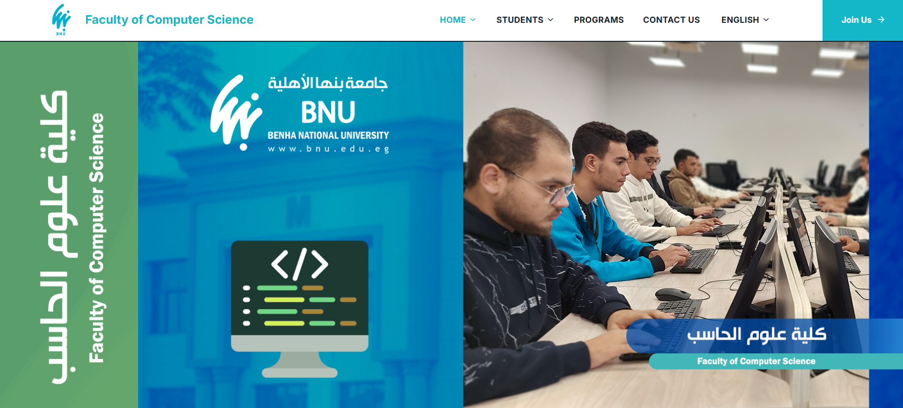

# Faculty of Computer Science — Benha National University

A React web application recreating the official website of the Faculty of Computer Science at Benha National University (https://cs.bnu.edu.eg/), built to match its real navigation, pages, and content — implemented from scratch with modern frontend practices, reusable components, and full Arabic/English bilingual support.

## Project Overview

This project is a client-side, multi-page React application for a university faculty, covering academic programs, news, staff, student union information, and contact details. It mirrors the structure and content of the live site while being built independently with a component-driven architecture, real i18n (Arabic/English with RTL/LTR switching), client-side routing, and responsive design tested from mobile to desktop.

## Features

- **Full client-side routing** with React Router v7, including dynamic detail routes (`/programs/:id`, `/news/:id`) and a dedicated 404 page
- **Arabic / English language switcher** with real i18next-based translation and automatic RTL / LTR layout switching, persisted across sessions
- **Real dropdown navigation** matching the live site (Home ▾, Students ▾, Programs, Contact Us, Join Us) with a fully responsive mobile menu
- **News carousel** (Swiper) on the homepage, plus a full News listing and article detail pages
- **Programs listing** with detail pages (fees, duration, description) per specialization
- **Contact page** with client-side form validation (name, email, subject, message) and an embedded Google Map
- **Student Union Council, Staff Members, Dean's Speech, Bachelor Regulations** and other informational pages matching the real site's structure
- **Loading / Empty / Error state components** used consistently across data-driven pages
- **Reusable UI components**: Button, Modal, SectionTitle, NewsCard, ProgramCard, StaffCard, Logo, and shared state components
- Fully responsive layout, from 360px mobile up through desktop

## Technologies

- **React 18** with functional components and hooks
- **React Router v7** for client-side routing
- **Vite** as the build tool and dev server
- **Tailwind CSS** for styling (utility-first, custom theme in `tailwind.config.js`)
- **i18next / react-i18next / i18next-browser-languagedetector** for internationalization and language detection
- **Swiper** for the homepage news carousel
- **lucide-react** for icons

## Project Structure

src/
├── assets/ # Images and icons
├── components/
│ ├── cards/ # NewsCard, ProgramCard, StaffCard
│ └── ui/ # Button, Modal, SectionTitle, Logo, NewsCarousel, states/
├── data/ # Real content: programs, news, staff, student union, site config
├── layouts/
│ ├── Navbar/ # Navbar + LanguageSwitcher
│ └── Footer/
├── locales/
│ ├── en/translation.json
│ └── ar/translation.json
├── pages/ # One folder per page (Home, About, Programs, News, Contact, ...)
├── routes/
│ └── AppRouter.jsx
├── i18n.js
├── App.jsx
└── main.jsx

## Installation

Requires [Node.js](https://nodejs.org/) 18+ and npm.

```bash
# 1. Clone the repository
git clone (https://github.com/MohammedZakaria291/React_project_Team_23)
cd bnu-cs-website

# 2. Install dependencies
npm install
```

## Running Locally

```bash
npm run dev
```

Then open **http://localhost:5173** in your browser. The app supports hot-reload — changes to any file are reflected instantly.

## Build

To create an optimized production build:

```bash
npm run build
```

The compiled output is written to `dist/`. To preview the production build locally:

```bash
npm run preview
```

## Screenshots

> Add screenshots of the running app here before submitting, e.g.:
>
> | Home | Programs | News | Contact |
> |------|----------|------|---------|
> |  |  |  |  |
>
> Include both English (LTR) and Arabic (RTL) views, plus a mobile screenshot, to show the responsive and bilingual behavior.

## Notes on Data & Content

- Program, news, and staff data (names, dates, images) are sourced from the live site's public pages; descriptive text is rewritten in our own words rather than copied verbatim, in line with copyright practice.
- Images are referenced directly from `cs.bnu.edu.eg`'s public media URLs rather than re-hosted, since this is an academic/portfolio recreation and not a redistribution of the university's media assets.
- UI chrome (navigation, buttons, forms, footer) is fully bilingual via `locales/en` and `locales/ar`; RTL layout is applied automatically when Arabic is selected.

## License

This project was built for academic purposes as part of a Faculty of Computer Science coursework assignment. It is not affiliated with or endorsed by Benha National University.
